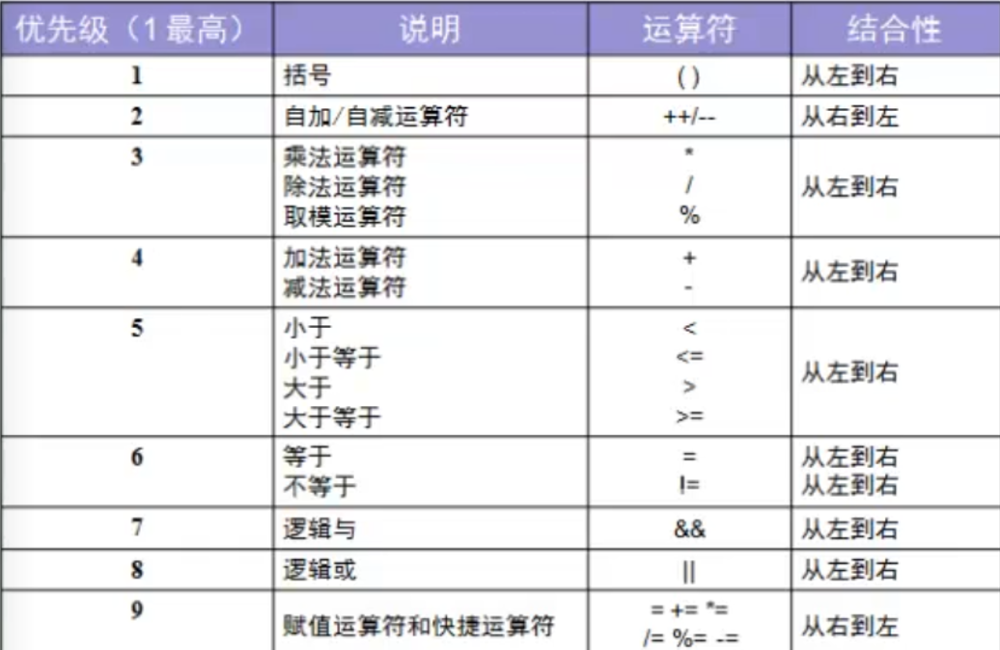
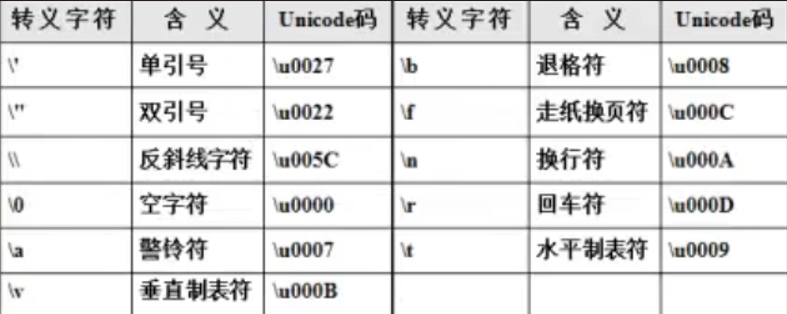
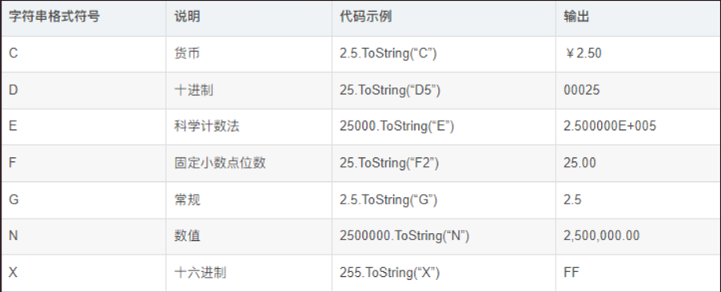

[toc]
** **
** **
** **
## 2022.02.23
### 常量
const 关键字用于声明符号常量
	语法：
		const 数据类型 常量命=常量值；
		例：
				```const int Inttest=1；```
	特性：
		const声明的常量值无法被修改；
___
### 运算符
“/”执行除法运算
“%”执行取余运算
值类型转空值：在数据类型后面添加问号可将值赋值为空；
例：
	```int ？ i = null ;```
#### 运算优先级

___
### 转义字符
转义字符：‘\’
例：
	```char charA=‘\’```
常用转义表：



___
### 自加减运算
例：
	```num2=++num1  ——  num1=num1+1；num2=num1；``` 先自加运算再赋值；
	```num2=num1--  ——  num2=num1；num1=num1-1；``` 先赋值再自减运算；
___
### 数据类型转换//装箱与拆箱
数据类型转换：
例：
	```object ob=12.3; float fl= Convert.ToSingle(ob);```  把引用类型转换成单精度浮点数据类型
装箱：将值类型包装成引用类型的处理过程；
	备注：装箱可以隐式转换，拆箱必须显示的强制转换
	例：
```
	_int i=10;_
	_object ob = i; //装箱_
	_int j =int(ob); //拆箱_
```
拆箱：将引用类型转换为值类型；
	1.从托管堆中为新生成的引用对象分配内存；
	2.将值类型的数据拷贝到刚刚分配的内存中；
	3.返回托管堆中新分配的对象的地址；
___
Var类型：在程序运行时由程序自行判断数据类型；
<br>
***
***
***
## 2022.02.24
### 循环语句类型
#### if...else语句

#### switch...case语句
语法：
```
switch（变量）
{
	case <值1>: _单语句；_
	<语句块>
	break;<br>
	case <值2>:
	<语句块>
	break;<br>
	case <值3>: _共用语句；_
	case <值4>:
	case <值5>:
	<语句块>
	break;<br>
	default:_如果与所有case都不匹配，执行以下代码；_
	<语句块>
	break;
}
```
#### while循环
语法：
```
while(条件)_如果条件为真会一直循环执行<语句块>；_
{
	<语句块>;
}
```
#### do...while循环_语句先执行一次<语句块>再判断，如果(条件)为真则再次执行；_
语法：
```
do
{
	<语句块>
}
while(条件)
```
#### for循环
语法：
```
for(初始值;条件;增/减)
{
	<语句块>
}
```
循环步骤：
a:初始值;b:条件;c:增/减
第一步：执行a和b；
第二步：如果b为true执行<语句块>；
第三步：执行c，执行b，判断b是否为true；
第四步：b为true继续执行<语句块>，为false结束for循环；

___
#### 结束循环

break:立即结束跳出循环;

continue:结束本次循环，继续执行下次循环；
例：
```
for(int i=1;i<=100;i++)
{
	if(i == 50)
	{
		continue;
	}
	Console.Writeline(i);
}
当i=50的时候不会执行continue后面的代码输出50，但是会继续进行循环i++并输出51...
```
goto//不推荐使用破坏程序完整性

return:跳出循环，并返回一个值；

___

### 数组
数组属于引用类型，存储在堆内存中；
访问数组：使用索引访问数组，索引从0开始，索引长度为存储元素数量减1；

#### 定义数组
第一种定义法：直接赋值法；
	```int[] intArray={40，50，70，80，90};```
第二种定义法：规定长度不赋值，通过索引为数组赋值；
```
	string[] strArray=new string[3];
	strArray[0]="1";
```
#### 数组扩容：

```
int[] intArray={40,20,30,60}; 初始数组；
int[] tmp=new int[intArray.Length+1]; 预设扩容数组；
for(int i=0;i<intArray.Length;i++) 将初始数组的数据迁移到预设数组tmp；
{
	tmp[i]=intArray[i];
}
int addNum=Convert.ToInt30(Console.ReadLine());
tmp[tmp.Length-1]=addNum; 将新增数据添加到预设数组tmp；
intArray=tmp; 让初始数组指向扩容后的数组内存；
```

#### 缩减数组：

```
int[] intArray={40,20,30,60}; 初始数组；
int getNum=Convert.ToInt30(Console.ReadLine()); 需要减去的元素；
int inDex=-1; 预设需减去的元素的索引；
for(int i=0;i<intArray.Length;i++)
{
	if(intArray[i]=getNum)
	{
			inDex=i;_遍历数组将匹配到的元素的索引赋值给预设索引inDex；_
			break;
	}
}
if( inDex>=0)
{
	int[] tmp =new int[intArray.Length-1];_缩减长度的预设数组；_
	for(i=0;i<tem.Length;i++)_遍历数组将数据迁移到预设数组tmp；_
	{
			if(i>=inDex)
			{
					tmp[i]=intArray[i+1];
			}
			else
			{
					tmp[i]=intArray[i];
			}
	}
}
intArray=tmp;_让初始数组指向缩减后的数组内存；_
```
***
***
***
## 2022.02.25
### 冒泡排序
```
for(int i=0;i<Array.Length;i++)
 {
		for(int j=1;j<Array.Length-i;j++)
	 {
		if(Array[j-1]>Array[j])
		 {
			int tmp=Array[j-1];
			Array[j-1]=Array[j];
			Array[j]=tmp;
		 }
	 }
 }
```
 
### 动态数组：ArrayList
引入命名空间：

```
using System.Collection;
ArrayList arrayList= new ArrayList(); 声明动态数组；
arrayList.Add(值); 添加元素；
arrayList.Capacity ArrayList长度；
foreach (object o in arrayList)
{
	Console.WriteLine(o); 输出ArrayList中的元素；
}
arrayList.Sort(); 排序；
arrayList.Insert(插入位置索引,插入值);ArrayList插入值；
arrayList.Remove(删除值); ArrayList删除值；
arrayList.RemoveAt(删除值的索引值);
int randIndex=new Random().Next(开始值,结束值); 抽取随机数；
arrayList.Contains(arrayTest[值]); 判断arrayList数组内是否已经存在arrayTest[值]；
```

### 字符串操作

#### 字符串比较：CompareTo
```
int tmp=字符串1.CompareTo(字符串2);
```
如果字符串1小于字符串2，tmp=-1，等于tmp=0，大于tmp=1；
#### 定位字符串：IndexOf
```
int index=strArray.IndexOf(''/"");
int index=strArray.LastIndexOf(''/"");
```
IndexOf从前往后找，LastIndexOf从后往前找；
#### 格式化字符串：Format
例：输出钱的格式
```
double dMoney = 33445555.33333;
string strMoney = string.Format("{0:c}",dMoney);
```
0表示占位符，c表示目标格式，dMoney表示目标字符串；



___
#### 连接字符串：+/Concat/Join
<br>

***
***
***
## 2022.02.26
### 字符串操作
#### 分裂字符串：Split
语法：
```
string[] strArray=需要分裂的字符串数组.split(new char[]{'根据什么符号分裂'})；
```
#### 判断字符串是否为空或者空格：IsNullOrEmpty
语法：
```
if(string.IsNullOrEmpty(需要判断的字符串))
```
#### 清空字符串中的空格：Trim
语法：
```
字符串=字符串.Trim; 清空字符串内所有空格；
字符串=字符串.TrimStart; 清空字符串前面的空格；
字符串=字符串.TrimEnd; 清空字符串后面的空格；
```
#### 字符串替换方法：Replace
语法：
```
字符串=字符串.Replace('替换的字符','被替换的字符');
```
#### 字符串大小写转换：ToUpper/ToLower
语法：
```
字符串=字符串.ToUpper(); 转换为大写；
字符串=字符串.ToLower(); 转换为小写；
```
### 日期操作：DateTime
#### 当前日期
语法：
```
DateTime dtime=DateTime.Now();
```
#### 日期加减：AddDays()
语法：
```
DateTime dtime=DateTime.Now().AddDays(Value);
```
#### 输出日期格式转换
语法：
```
string strTime = dtime.ToString("yyyy年MM月dd日 HH时mm分ss秒") HH表示24小时制，hh表示12小时制；
```
### 类：Class
#### 类与对象
类：模板，一种概念；
对象：根据类（模板）创造出来的一个具体的实例；
#### 构造函数
 概念：用于实例化对象并且在内存中分配存储数据的区域，new方法就是在内存中分配数据区域；
 语法：
```
[访问修饰符] 类名()
{
    //构造函数主体；
}
```
例：
```
public class Student()
{
    public string name;
    public int stuno;
    public int age;
    //无参构造函数；
    public Student()
    {
        
    }   
    //有参构造函数；
    public Student(string _name,int _stuno,int _age)
    {
        this.name=_name;
        this.stuno=_stuno;
        this.age=_age;
    } 
    //this可以省略；
    //一个构造函数里面可以有多个方法；
}
```
### This关键字
概念：表示访问这个类本身的数据；
### 方法
#### 方法的调用
概念：方法指对象的行为；
语法：
```
[访问修饰符] 返回数据类型 方法名(参数列表)
{
    return 返回值；
}
//void 表示没有返回值；
//方法分无参和有参两种，定义方法时方法里的参数叫做形参；
```
#### 方法的参数：值参数,ref,out,params
##### 值参数
概念：值参数是将传入的值参数先复制一份，然后再传入方法中，方法中的运算等操作不会改变原有的参数值；
语法：
```
class Person
{
定义值参数方法：
    public void ChangeAge(int age)
    {
        age=age+10;
    }
}
调用值参数方法：
class Program
{
    int myage=10;
    Person p=new Person();
    p.ChangeAge(myage);
    Console.WriteLine(Myage);//输出结果为10，原参数未被修改；
}
```
##### 引用参数：ref
概念：引用参数是直接将原参数的值直接赋予方法进行操作，方法操作后会改变原有参数的值,在定义方法和调用方法传参时都必须添加ref修饰符，且原参数必须赋值；
语法：
```
class Person
{
定义引用参数方法：
    public void ChangeAge(ref int age)
    {
        age=age+10;
    }
}
调用引用参数方法：
class Program
{
    int myage=10;
    Person p=new Person();
    p.ChangeAge(ref myage);
    Console.WriteLine(Myage);//输出结果为20，原参数被修改；
}

```
##### 输出参数：out
概念：讲原参数值赋予方法操作，会修改原参数的值，但是原参数可以不用赋值，定义方法和调用方法时参数前面必须有out修饰符；
```
class Person
{
定义输出参数方法：
    public void ChangeAge(out int age)
    {
        age=age+10;
    }
}
调用引用参数方法：
class Program
{
    int myage;
    Person p=new Person();
    p.ChangeAge(out myage);
    Console.WriteLine(Myage);//原参数不用赋值，输出结果为10，原参数被修改；
}

```
##### 数组参数：params
概念：强调表示一个可变的数组；
```
class Person
{
定义数组参数方法：
    public void ChangeAge(params int[] age)
    {
        forech(int i in age )
        {
            Console.WriteLine(i);
        }
    }
}
调用数组参数方法：
class Program
{
    int[] myage={12,13,14,15};
    Person p=new Person();
    p.ChangeAge(params myage);
}

```
***
***
***
## 2022.02.27
### 静态字段：static
概念：
* 静态字段是长期驻留在内存中的；
* 静态类中不允许出现实例化的字段或者方法；
语法：
 
```
//静态字段
public static [修饰符] 字段名；
//静态方法
public static [修饰符] 方法名()
{
    
}
```
在普通类中静态字段/方法可以和实例化的方法同时存在，实例化的方法可以访问静态字段，静态方法也可以访问静态字段；
***
***
***
## 2022.03.07
### 方法的重载
* 方法重载必须要求的是方法名字和返回值一致；
* 方法的参数个数不一致；
* 方法的参数类型不一致；
### 命名空间
引用：using 命名空间；
### 封装
语法：
```
private string cardid;
private double bankMoney;
//get只读方法；
public string Cardid
{
    get
    {
        return cardid;
    }
}
//set可读写；
public double BankMoney
{
    get
    {
        return bankMoney;
    }
    set
    {
        bankMoney=value;
    }
}
```
### 继承
子类只继承父类的非priavte属性和无参构造函数，如果需要子类继承父类的有参构造函数，需要使用":base()"关键字；
语法：
```
//父类，基类；
public class Person
{
    private string name;
    private string sex;
    private int age;
    public string Name
    {
        get
        {
            return name;
        }
        set
        {
            name=value;
        }
    }
    public string Sex
    {
        get
        {
            return sex;
        }
        get
        {
            sex=value;
        }
    }
    public int Age
    {
        get
        {
            return age;
        }
        set
        {
            age=value;
        }
    }
    public Person(string _name,string _sex,int _age)
    {
        this.name=_name;
        this.sex=_sex;
        this.age=_age;
    }
    public Persson()
    {
        
    }
}
//子类，派生类；
public class Doctor:Person
{
//子类在继承父类的基础上添加属性；
    private string departName;
    public string DepartName
    {
        get
        {
            return departName;
        }
        set
        {
            departName=value;
        }
    }
    //子类继承父类有参构造函数；
    public Doctor(string _name,string _sex,int _age,string _departName):base(_name,_sex,_age)
    {
        this.departName=_dpartName;
    }
}
//调用；
class Program
{
    static void Main(string[] args)
    {
    //子类默认继承父类的无参构造函数，所以父类需要创建无参构造函数；
    //子类继承父类无参构造函数的使用；
        Doctor d=new Doctor();
        d.Name="张三";
        d.Sex="男";
        d.Age=12;
   //子类继承父类有参构造函数的使用；
        Doctor d=new Doctor("张三","男",12,"内科");
    }
}
```

#### 方法的重写与覆盖
##### 重写_虚方法：virtual/override
概念：父类中定义方法时在方法（构造函数）前添加virtual关键字表示该方法可以在子类中重写，子类在继承引用方法的时候需要添加override关键字，可以选择重写或者直接引用父类方法（base.方法名）；
语法：

```
//父类
public class Person
{
    public virtual void ShowInfo()
    {
        
    }
}
//子类
class Doctor
{
    public override void ShowInfo()
    {
        //直接继承引用父类的方法；
        base.ShowInfo();
        //重写方法；
        Console.WriteLine("");
    }
}
```
##### 覆盖：new
概念：在子类中定义与父类中同名的方法（构造函数），可以在方法前添加new关键字对父类中的方法进行覆盖；
语法：
```
//父类
public class Person
{
    public void ShowInfo()
    {
        
    }
}
//子类
class Doctor
{
    public new void ShowInfo()
    {
    
    }
}
```
### 多态
概念：多态是指两个或者多个属于不同类的对象，对同一个消息作出不同响应能力；
#### 抽象类：abstract
特征：
* 抽象类不能直接被实例化，只能通过子类去实例化；
* 抽象类不能用sealed修饰符修改，抽象类都是拿来继承的；
* 从抽象类派生的非抽象类必须包括继承继承所有抽象的方法和抽象访问器的实现；
语法：
    public string AnimalColor
```
//抽象父类
public abstract class Animal
{
    private string animalColor;
    private string animalName;
    public string AnimalColor
    {
        get
        {
            return animalColor;
        }
        set
        {
            animalColor=value;
        }
    }
    public string AnimalName
    {
        get
        {
            return animalName;
        }
        set
        {
            animalName=value;
        }
    }
    public Animal(string _animalColor,string _animalName)
    {
        this.animalColor=_animalColor;
        this.animalName=_animalName;
    }
    //在父类定义抽象方法,那么方法没有主体，只有定义,但是派生类必须重写该方法；
    public abstract void ShowIt();
}

//子类继承
class Dog:Animal
{
    //子类重写抽象方法；
    public override void ShowIt()
    {
        //方法体；
    }
}
//实例化
class Program
{
    static void Main(string[] args)
    {
    //错误实例化方法，抽象类不能直接被实例化；
        Animal animal=new Animal();
    //正确实例化方法；
        Animal dog=new Dog();
        //或者
        Dog dog=new Dog();
    }
}

```
***
***
***
## 2022.03.09
### 多态
#### 接口：interface
* 接口是对子类的一种约束，具有较好的扩展性；
* 接口之中只能对方法进行定义；
* 接口和抽象类的区别在于，抽象类有字段和属性，接口没有字段和属性；
* 一个类只能继承一个抽象类，但是可以继承多个接口；
* 继承接口的子类必须重写接口定义的方法，但是不用override关键字；
* 接口的命名以“I”开头；  
语法：
```
//定义接口
interface IBank
{
    viod Count(double num);
}
//子类继承
class UserCard:IBank
{
    private double bankMoney;
    public double BankMoney
    {
        get
        {
            return this.bankMoney;
        }
        set
        {
            if(value<0)
            {
                this.bankMoney=0;
            }
            else
            {
                this.bankMoney=value;
            }
        }
    }
    public void Count(double num)
    {
        this.bankMoney-=num;
    }
}
//调用
class Program
{
    static void Main(strig[] args)
    {
        UserCard User=new UserCard();
        User.BankMoney=200;
        User.Count(100);
    }
}
```
### 集合
#### 哈希表集合：Hash
* Hash集合是键值对，每个键都是唯一的；
* 使用Hash集合需要引入命名空间：System.Collections；
语法：
```
class Program
{
    static void Main(strig[] args)
    {
        Hashtable hash=new Hashtable();
        //往Hash集合添加数据；
        hash.Add(1,"hello");
        hash.Add(2,"world");
        //访问Hash集合内的单个数据，使用键的方法；
        Console.WriteLine(hash[1]);
        //访问所有的数据第一种方法：遍历;
        var keys=hash.Keys;//hash键的集合；
        foreach(object o in keys)
        {
            Console.WriteLine(hash[o]);
        }
        //第二种，使用遍历器；
        var ie=hash.GetEnumerator();
        while(ie.MoveNext())
        {
           Console.WriteLine(ie.value); 
        }
    }
}
```
***
***
***
## 2022.03.19
### 泛型：List<数据类型>
概念：泛型的特点就是类型的安全，规定了在集合中所存储的数据类型；
语法：
```
using System.Collections.Generic;

List<数据类型> list = new List<数据类型>();
list.Add(1);//添加数据；
//泛型的遍历1；
foreach(int i in list)
{
    Console.WriteLine("输出的数据："+i);
}
//泛型的遍历2；
for(int i=0;i<list.Count;i++)
{
    Console.WriteLine("泛型的索引{0}，泛型的值{1}",i,list[i]);
}
```
### 字典：Dictionary<键的数据类型，值的数据类型>
概念：键值对存储，可以使用泛型；
语法：
```
using System.Collection;
Dictionary<键的数据类型，值的数据类型> dic = new Dictionary<键的数据类型，值的数据类型>();
dic.Add(1,1);
//遍历字典数据方法1；
var skeys = dic.Keys;
foreach(string i in skeys)
{
    Console.WriteLine("键：{0}，值“{1}",i,dic[i]);
}
//遍历字典数据方法2：遍历器；
var i = dic.GetEnumerator();
while (i.Move.Next())
{
    Console.WriteLine("键：{0}，值：{1}",i.Current.Key,I.Current.value);
}
```
### 异常处理
概念：异常指在程序 运行中出现的问题，而非编译时出现的问题；
语法：
```
try
{
    语句块；
}
catch(Exception ex)
{
    Console.WriteLine("异常原因："+ex.Message);
}
finally//finally 表示是否发生异常都会执行的代码；
{
    语句块；
}
```
